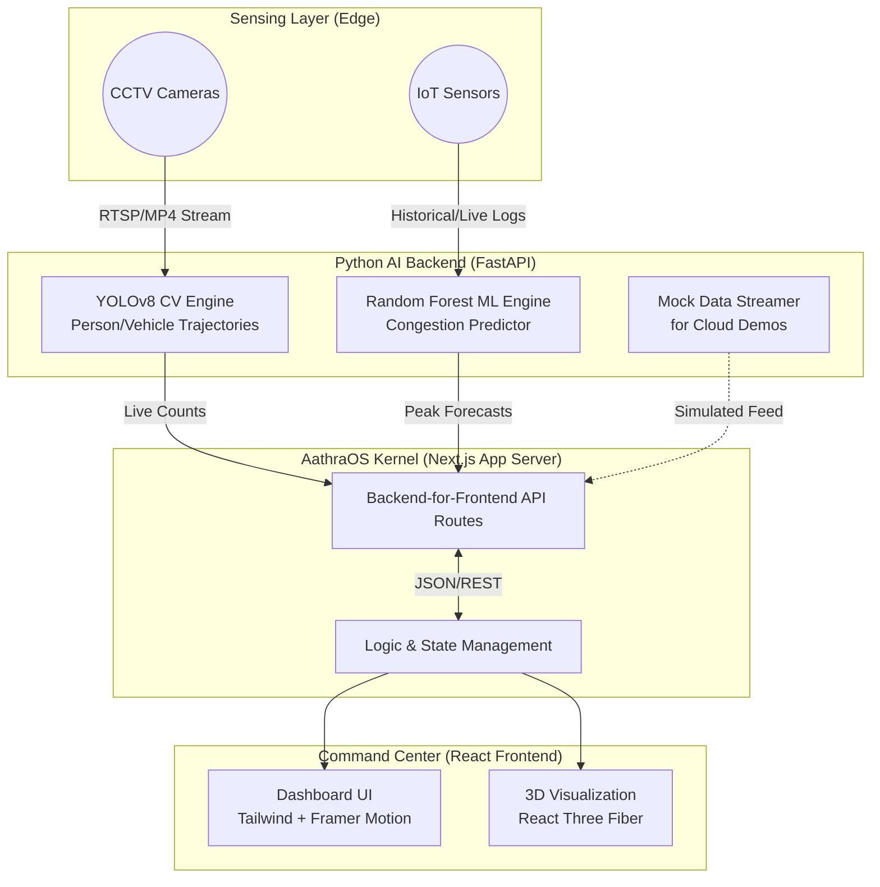

# AathraOS - Urban Operating System

 <!-- Placeholder for actual screenshot/logo -->

AathraOS is a sentient kernel that transforms urban campuses and cities into self-orchestrating intelligent environments. It serves as an operating system for smart cities that senses, predicts, decides, and evolves using real-time surveillance and machine learning.


---

## 🌟 Why AathraOS?

Urban infrastructure often operates in silos—mobility, safety, energy, and behavior are managed separately. **AathraOS** unified these domains into a single "Command Center". By fusing real-time computer vision from CCTV feeds with predictive machine learning models, AathraOS transitions urban management from reactive to proactively self-governed operations.

It solves congestion, energy waste, and public safety issues by autonomously forecasting spikes and emitting nudging commands (e.g., directing traffic, adjusting HVAC, dispatching shuttles).

---

## ⚡ Features It Allows

1. **Real-time Traffic & Crowd Tracking**: Headless YOLOv8 computer vision object counting on live CCTV streams, dynamically tracking campus population and mobility loads (persons and vehicles).
2. **AI Peak Forecasting**: A Random Forest machine learning microservice that analyzes historical metrics to predict weekly peak congestion hours with high confidence.
3. **Safe-Mobility Nudging**: Automated routing diversions, parking load balancing, and behavioral nudges based on live risk assessments.
4. **Predictive Alerts**: Advanced warning systems for event surges, high collision risk zones, and optimal dispatch windows.
5. **Utilities Coupling**: Integrates mobility data with city utilities:
    *   **HVAC Pre-cooling**: Adjusts building climates based on upcoming predicted campus population surges.
    *   **Charging Operations**: Optimal fleet charging schedules aligned with demand.
    *   **Lighting Adaptation**: Dynamic ambient light adjustment dependent on detected crowd density.
6. **Command Center Dashboard**: Built with Next.js, Framer Motion, and TailwindCSS for a highly aesthetic, responsive, and 3D-enhanced real-time viewing experience.

---

## 🏗️ Architecture Diagram



### How It Works

1. **Vision Ingestion**: The backend ingests CCTV streams or standard MP4 files via the YOLOv8-powered `cv_counter.py`. It tracks objects frame-by-frame.
2. **Prediction Pipeline**: The `peak_predictor.py` script takes historic traffic and weather conditions to construct forecasting scenarios using a Random Forest model.
3. **REST Distribution**: A FastAPI server (`app.py` / `api.py`) routes these insights instantly.
4. **Frontend Consumption**: The Next.js API routes (`src/app/api/...`) proxy requests from the backend and funnel them into the Command Center dashboard.
5. **UI Update**: The frontend leverages React state to update the mobility dashboard, alerting the operators and dynamically updating responsive Next.js/Three.js components.

---

## 📁 Folder Structure

```text
aathraos/
├── public/                     # Static assets, fonts, icons
├── src/                        # ⚛️ Next.js Frontend Application
│   ├── app/                    # App Router implementation
│   │   ├── api/                # Next.js API Routes (BFF proxy)
│   │   ├── dashboard/          # Command Center view
│   │   ├── login/              # Authentication view
│   │   ├── globals.css         # Tailwind & custom glassmorphism styles
│   │   ├── layout.tsx          # Root DOM layout
│   │   └── page.tsx            # Main Landing Page (Hero, Modules, etc.)
│   └── components/             # Reusable UI & 3D Components
│       ├── dashboard/          # Map widgets, status cards, and layout elements 
│       └── landing/            # 3D Particle Fields, Hero Section, Feature Grids
├── traffic_crowd_prediction/   # 🐍 Python ML / CV Microservice
│   ├── api.py                  # Primary FastAPI Application
│   ├── app.py                  # Alternative FastAPI server structure
│   ├── cv_counter.py           # YOLOv8 implementation for tracking streams
│   ├── fake_api.py             # Lightweight mock API wrapper (for cheap hosting)
│   ├── peak_predictor.py       # Random Forest generation and evaluation
│   ├── generate_synthetic_data.py # Dataset generation script
│   ├── requirements.txt        # Python pip dependencies
│   ├── start.sh                # Uvicorn entry points for Docker
│   ├── yolov8n.pt              # YOLO Weights (Pretrained)
│   └── Dockerfile              # Container spec for HuggingFace Spaces/AWS deployment
├── package.json                # Node modules and build scripts
├── tailwind.config.ts          # Styling theme configurations
└── .env                        # Environment variable secrets (Not committed)
```

---

## 🚀 Getting Started

### 1. Running the AI Backend (Python)

If you have a dedicated machine, navigate to the `traffic_crowd_prediction` directory:

```bash
cd traffic_crowd_prediction
pip install -r requirements.txt
# Run the mock API for development
python fake_api.py 
# OR, to run the actual YOLO service
uvicorn api:app --host 0.0.0.0 --port 8000
```

*Note: For cloud hosting like Hugging Face, simply push the `traffic_crowd_prediction` folder as a linked Docker space.*

### 2. Running the AathraOS Frontend (Next.js)

From the project root directory, install NPM dependencies and start the development server:

```bash
npm install
npm run dev
```

The Command Center will boot up on [http://localhost:3000](http://localhost:3000).

---

## 🛠️ Stack Overview

- **Frontend**: Next.js 15+, React 19, Tailwind CSS v4, Framer Motion, Lucide Icons.
- **3D Graphics**: `react-three-fiber`, `react-three-drei`, `three.js`.
- **Backend / AI**: Python 3.9+, YOLOv8 (ultralytics), OpenCV, FastAPI, Scikit-Learn.
- **AI Integration**: `@google/genai` (For future conversational LLM interfaces).

---

**AathraOS** © 2026. *One system that senses, predicts, decides, and evolves.*
